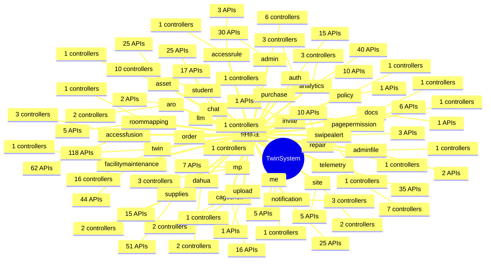

# TwinSystem 业务逻辑全景

> 自动生成于 2026/6/9 10:43:25 | Scanner v0.1.0

## 业务域总览

## 统计

| 业务域 | 控制器 | 服务 | API | 页面 | 交互 |
|--------|--------|------|-----|------|------|
| accessfusion | 3 | 18 | 62 | 3 | 0 |
| accessrule | 1 | 2 | 3 | 0 | 0 |
| admin | 6 | 2 | 30 | 0 | 0 |
| adminfile | 1 | 1 | 2 | 0 | 0 |
| analytics | 3 | 15 | 40 | 0 | 0 |
| aro | 2 | 6 | 2 | 0 | 0 |
| asset | 1 | 1 | 25 | 0 | 0 |
| auth | 3 | 6 | 15 | 0 | 0 |
| cageshelf | 2 | 4 | 16 | 0 | 0 |
| chat | 1 | 1 | 17 | 0 | 0 |
| dahua | 2 | 8 | 15 | 0 | 0 |
| docs | 1 | 0 | 1 | 0 | 0 |
| facilitymaintenance | 1 | 1 | 44 | 0 | 0 |
| invite | 1 | 1 | 1 | 0 | 0 |
| llm | 0 | 1 | 0 | 0 | 0 |
| me | 1 | 4 | 5 | 0 | 0 |
| mp | 3 | 3 | 7 | 0 | 0 |
| notification | 3 | 5 | 25 | 1 | 0 |
| order | 0 | 0 | 0 | 0 | 0 |
| pagepermission | 1 | 1 | 6 | 0 | 0 |
| policy | 1 | 2 | 1 | 0 | 0 |
| purchase | 1 | 1 | 10 | 2 | 0 |
| repair | 1 | 1 | 10 | 2 | 0 |
| roommapping | 1 | 1 | 5 | 0 | 0 |
| site | 2 | 2 | 5 | 0 | 0 |
| student | 10 | 9 | 25 | 0 | 0 |
| supplies | 2 | 2 | 51 | 7 | 0 |
| swipealert | 1 | 1 | 3 | 0 | 0 |
| telemetry | 7 | 12 | 35 | 0 | 0 |
| twin | 16 | 42 | 118 | 0 | 0 |
| upload | 1 | 1 | 1 | 0 | 0 |

## 域间交互
