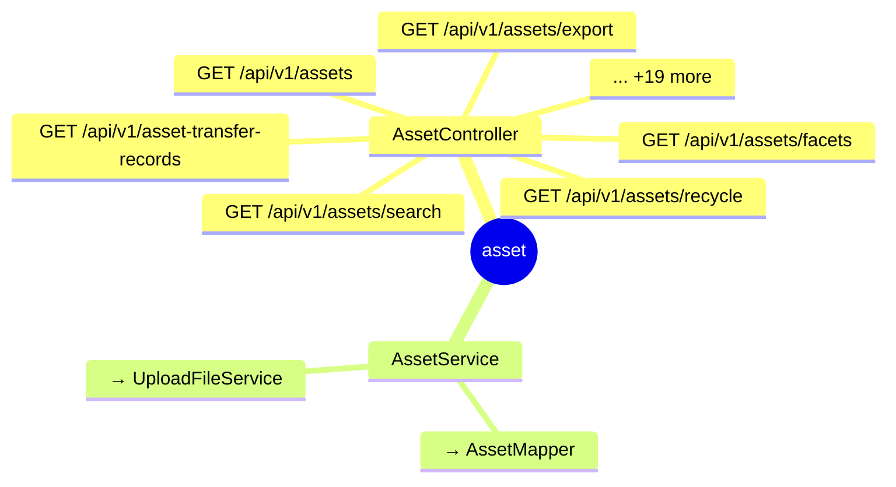

# asset

## 模块结构

## API 清单

| 方法 | 路径 | 控制器 | 说明 |
|------|------|--------|------|
| GET | `/api/v1/assets` | AssetController |  |
| GET | `/api/v1/assets/export` | AssetController |  |
| GET | `/api/v1/assets/search` | AssetController |  |
| GET | `/api/v1/assets/facets` | AssetController |  |
| GET | `/api/v1/assets/recycle` | AssetController |  |
| GET | `/api/v1/asset-transfer-records` | AssetController |  |
| GET | `/api/v1/asset-transfer-records/export` | AssetController |  |
| GET | `/api/v1/asset-transfer-records/{id}/pdf-links` | AssetController |  |
| GET | `/api/v1/asset-transfer-records/download/{token}` | AssetController |  |
| POST | `/api/v1/assets/import` | AssetController |  |
| POST | `/api/v1/assets/columns` | AssetController |  |
| POST | `/api/v1/assets` | AssetController |  |
| POST | `/api/v1/assets/recycle/{id}/restore` | AssetController |  |
| POST | `/api/v1/assets/{id}/lock` | AssetController |  |
| POST | `/api/v1/asset-transfer-requests` | AssetController |  |
| POST | `/api/v1/asset-transfer-requests/{id}/after-photos/remove` | AssetController |  |
| POST | `/api/v1/asset-transfer-requests/{id}/complete` | AssetController |  |
| POST | `/api/v1/asset-transfer-requests/{id}/withdraw` | AssetController |  |
| POST | `/api/v1/asset-transfer-records/{id}/pdf-link` | AssetController |  |
| DELETE | `/api/v1/assets` | AssetController |  |
| DELETE | `/api/v1/assets/{id}` | AssetController |  |
| DELETE | `/api/v1/assets/recycle/{id}` | AssetController |  |
| DELETE | `/api/v1/asset-transfer-requests/{id}` | AssetController |  |
| PATCH | `/api/v1/assets/{id}` | AssetController |  |
| PATCH | `/api/v1/asset-transfer-requests/{id}/after-photos` | AssetController |  |
