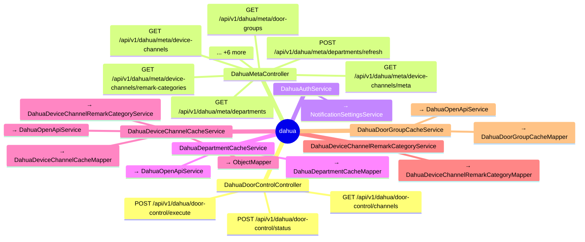

# dahua

## 模块结构

## API 清单

| 方法 | 路径 | 控制器 | 说明 |
|------|------|--------|------|
| GET | `/api/v1/dahua/door-control/channels` | DahuaDoorControlController |  |
| POST | `/api/v1/dahua/door-control/execute` | DahuaDoorControlController |  |
| POST | `/api/v1/dahua/door-control/status` | DahuaDoorControlController |  |
| GET | `/api/v1/dahua/meta/departments` | DahuaMetaController |  |
| GET | `/api/v1/dahua/meta/door-groups` | DahuaMetaController |  |
| GET | `/api/v1/dahua/meta/device-channels` | DahuaMetaController |  |
| GET | `/api/v1/dahua/meta/device-channels/remark-categories` | DahuaMetaController |  |
| GET | `/api/v1/dahua/meta/device-channels/meta` | DahuaMetaController |  |
| POST | `/api/v1/dahua/meta/departments/refresh` | DahuaMetaController |  |
| POST | `/api/v1/dahua/meta/door-groups/refresh` | DahuaMetaController |  |
| POST | `/api/v1/dahua/meta/device-channels/refresh` | DahuaMetaController |  |
| POST | `/api/v1/dahua/meta/device-channels/remark-categories` | DahuaMetaController |  |
| PUT | `/api/v1/dahua/meta/device-channels/remark-categories/{id}` | DahuaMetaController |  |
| DELETE | `/api/v1/dahua/meta/device-channels/remark-categories/{id}` | DahuaMetaController |  |
| PATCH | `/api/v1/dahua/meta/device-channels/{id}/remark` | DahuaMetaController |  |
