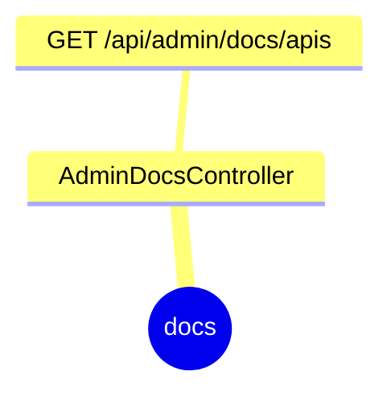

# docs

## 模块结构

```mermaid
mindmap
  root((docs))
    AdminDocsController
      GET /api/admin/docs/apis
```

## API 清单

| 方法 | 路径 | 控制器 | 说明 |
|------|------|--------|------|
| GET | `/api/admin/docs/apis` | AdminDocsController |  |
