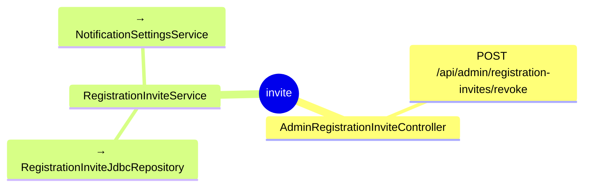

# invite

## 模块结构

```mermaid
mindmap
  root((invite))
    AdminRegistrationInviteController
      POST /api/admin/registration-invites/revoke
    RegistrationInviteService
      → RegistrationInviteJdbcRepository
      → NotificationSettingsService
```

## API 清单

| 方法 | 路径 | 控制器 | 说明 |
|------|------|--------|------|
| POST | `/api/admin/registration-invites/revoke` | AdminRegistrationInviteController |  |
