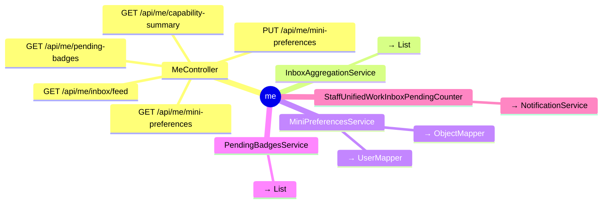

# me

## 模块结构

## API 清单

| 方法 | 路径 | 控制器 | 说明 |
|------|------|--------|------|
| GET | `/api/me/pending-badges` | MeController |  |
| GET | `/api/me/inbox/feed` | MeController |  |
| GET | `/api/me/capability-summary` | MeController |  |
| GET | `/api/me/mini-preferences` | MeController |  |
| PUT | `/api/me/mini-preferences` | MeController |  |
