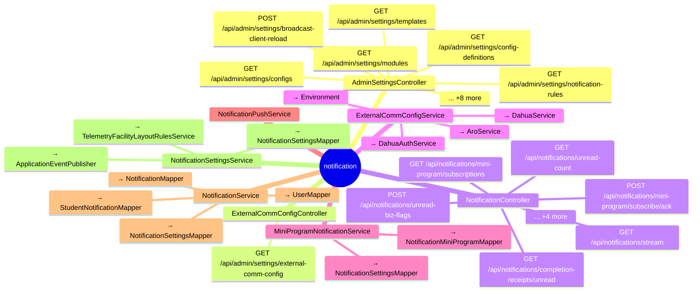

# notification

## 模块结构

## 前端页面

| 路由 | 组件 | API 调用数 |
|------|------|-----------|
| `/external-comm-config` | AdminExternalCommConfigPage | 6 |

## API 清单

| 方法 | 路径 | 控制器 | 说明 |
|------|------|--------|------|
| GET | `/api/admin/settings/modules` | AdminSettingsController |  |
| GET | `/api/admin/settings/notification-rules` | AdminSettingsController |  |
| GET | `/api/admin/settings/templates` | AdminSettingsController |  |
| GET | `/api/admin/settings/configs` | AdminSettingsController |  |
| GET | `/api/admin/settings/config-definitions` | AdminSettingsController |  |
| POST | `/api/admin/settings/broadcast-client-reload` | AdminSettingsController |  |
| POST | `/api/admin/settings/llm/test-connection` | AdminSettingsController |  |
| POST | `/api/admin/settings/dahua/test-connection` | AdminSettingsController |  |
| POST | `/api/admin/settings/aro/test-connection` | AdminSettingsController |  |
| POST | `/api/admin/settings/wincc/test-connection` | AdminSettingsController |  |
| POST | `/api/admin/settings/mini-program/test-send` | AdminSettingsController |  |
| PATCH | `/api/admin/settings/notification-rules/{id}` | AdminSettingsController |  |
| PATCH | `/api/admin/settings/templates/{id}` | AdminSettingsController |  |
| PATCH | `/api/admin/settings/configs/{id}` | AdminSettingsController |  |
| GET | `/api/admin/settings/external-comm-config` | ExternalCommConfigController |  |
| GET | `/api/notifications/unread-count` | NotificationController |  |
| GET | `/api/notifications/completion-receipts/unread` | NotificationController |  |
| GET | `/api/notifications/stream` | NotificationController |  |
| GET | `/api/notifications/mini-program/subscriptions` | NotificationController |  |
| POST | `/api/notifications/unread-biz-flags` | NotificationController |  |
| POST | `/api/notifications/mini-program/subscribe/ack` | NotificationController |  |
| DELETE | `/api/notifications/{id}` | NotificationController |  |
| PATCH | `/api/notifications/{id}/read` | NotificationController |  |
| PATCH | `/api/notifications/read-by-biz` | NotificationController |  |
| PATCH | `/api/notifications/read-all` | NotificationController |  |
