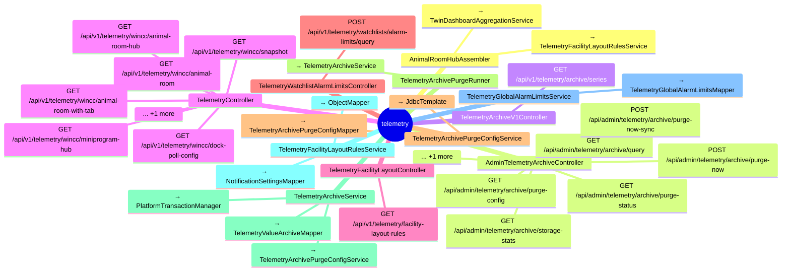

# telemetry

## 模块结构

## API 清单

| 方法 | 路径 | 控制器 | 说明 |
|------|------|--------|------|
| GET | `/api/admin/telemetry/archive/query` | AdminTelemetryArchiveController |  |
| GET | `/api/admin/telemetry/archive/purge-config` | AdminTelemetryArchiveController |  |
| GET | `/api/admin/telemetry/archive/storage-stats` | AdminTelemetryArchiveController |  |
| GET | `/api/admin/telemetry/archive/purge-status` | AdminTelemetryArchiveController |  |
| POST | `/api/admin/telemetry/archive/purge-now` | AdminTelemetryArchiveController |  |
| POST | `/api/admin/telemetry/archive/purge-now-sync` | AdminTelemetryArchiveController |  |
| PUT | `/api/admin/telemetry/archive/purge-config` | AdminTelemetryArchiveController |  |
| GET | `/api/v1/telemetry/archive/series` | TelemetryArchiveV1Controller |  |
| GET | `/api/v1/telemetry/wincc/dock-poll-config` | TelemetryController |  |
| GET | `/api/v1/telemetry/wincc/snapshot` | TelemetryController |  |
| GET | `/api/v1/telemetry/wincc/animal-room-hub` | TelemetryController |  |
| GET | `/api/v1/telemetry/wincc/animal-room` | TelemetryController |  |
| GET | `/api/v1/telemetry/wincc/animal-room-with-tab` | TelemetryController |  |
| GET | `/api/v1/telemetry/wincc/miniprogram-hub` | TelemetryController |  |
| GET | `/api/v1/telemetry/wincc/diagnostic/sequential-built-in-then-watchlist` | TelemetryController |  |
| GET | `/api/v1/telemetry/facility-layout-rules` | TelemetryFacilityLayoutController |  |
| POST | `/api/v1/telemetry/watchlists/alarm-limits/query` | TelemetryWatchlistAlarmLimitsController |  |
| GET | `/api/v1/telemetry/watchlists/global-alarm-limits` | TelemetryWatchlistController |  |
| GET | `/api/v1/telemetry/watchlists/metric-kinds` | TelemetryWatchlistController |  |
| GET | `/api/v1/telemetry/watchlists/admin/zones-with-tags` | TelemetryWatchlistController |  |
| GET | `/api/v1/telemetry/watchlists/{code}/tags/all` | TelemetryWatchlistController |  |
| GET | `/api/v1/telemetry/watchlists/{code}/tags` | TelemetryWatchlistController |  |
| POST | `/api/v1/telemetry/watchlists/metric-kinds` | TelemetryWatchlistController |  |
| POST | `/api/v1/telemetry/watchlists/quick-import-file` | TelemetryWatchlistController |  |
| POST | `/api/v1/telemetry/watchlists/{code}/activate` | TelemetryWatchlistController |  |
| POST | `/api/v1/telemetry/watchlists/{code}/import` | TelemetryWatchlistController |  |
| POST | `/api/v1/telemetry/watchlists/{code}/import-file` | TelemetryWatchlistController |  |
| PUT | `/api/v1/telemetry/watchlists/global-alarm-limits` | TelemetryWatchlistController |  |
| PUT | `/api/v1/telemetry/watchlists/metric-kinds/{code}` | TelemetryWatchlistController |  |
| PUT | `/api/v1/telemetry/watchlists/{code}/tags` | TelemetryWatchlistController |  |
| DELETE | `/api/v1/telemetry/watchlists/metric-kinds/{code}` | TelemetryWatchlistController |  |
| DELETE | `/api/v1/telemetry/watchlists/{code}` | TelemetryWatchlistController |  |
| PATCH | `/api/v1/telemetry/watchlists/{code}/poll-enabled` | TelemetryWatchlistController |  |
| PATCH | `/api/v1/telemetry/watchlists/{code}/tags/{id}/alarm-overrides` | TelemetryWatchlistController |  |
| POST | `/api/v1/telemetry/wincc/write-tag` | TelemetryWinCcWriteController |  |
