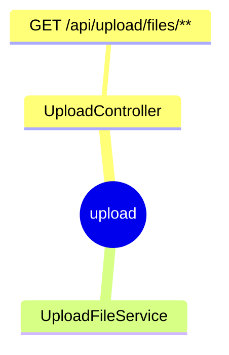

# upload

## 模块结构

```mermaid
mindmap
  root((upload))
    UploadController
      GET /api/upload/files/**
    UploadFileService
```

## API 清单

| 方法 | 路径 | 控制器 | 说明 |
|------|------|--------|------|
| GET | `/api/upload/files/**` | UploadController |  |
