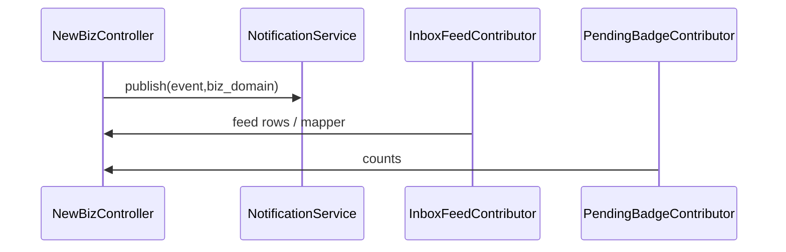

# 扩展新业务域（A 提交 → B 处理）清单

新增流程时 **不要** 在 `InboxAggregationService`、`PendingBadgesService.build` 主流程里写 `if (biz == X)`。应：**数据库配置 + 注册 Spring Bean（Contributor）+ 下列 Checklist**。

## 1. 稳定标识 `biz_domain`

- 全局唯一大写常量，集中定义在 [`BizDomains`](../src/main/java/com/example/demo/modules/policy/BizDomains.java)（或同级常量类）。
- 同一字符串用于：`biz_capability_policy.biz_domain`、`sys_notify_rule.biz_type`、`PublishNotificationEvent.bizType`、收件箱 `InboxItem.kind`、小程序 [`aroapp/miniprogram/utils/inboxKindRoutes.js`](../aroapp/miniprogram/utils/inboxKindRoutes.js) 标签映射（跳转见消息页 `onTimelineTap`）。

## 2. Checklist

| 步骤 | 说明 |
|------|------|
| 常量 | 在 `BizDomains` 增加 `public static final String X = "X"` |
| 策略行 | `biz_capability_policy` 插入一行（或通过管理端「业务能力策略」保存） |
| 通知规则 | `sys_notify_rule` 配置 `biz_type`、模板、`min_role_level` 等 |
| 页面权限 | `page_permission_item` 登记小程序/Web 路径（ENTRY + PAGE） |
| 角标 | 实现 `PendingBadgeContributor` `@Component`，在 `contribute` 内写入 `PendingBadgesSink` |
| 收件箱 | 实现 `InboxFeedContributor` `@Component`，`@Order` 控制顺序 |
| Controller | 使用 `CapabilityPolicyService` 的 `requireSubmit` / `requireProcess` / `canViewAllPending` |
| 小程序 | `app.json` 注册页面；`inboxKindRoutes.js` 增加 `kind → 跳转` |
| 网关 | 若走云函数，检查 [`springProxy`](../aroapp/cloudfunctions/springProxy/index.js) 前缀白名单（`/api/me` 已含 inbox） |
| 自测 | 申请人列表、处理人列表、角标、聚合收件箱、通知各走一遍 |

## 3. 禁止事项

- 禁止在 `InboxAggregationService` 内增加某业务专用 SQL 分支。
- 禁止在 `PendingBadgesService` 主方法内直接 `switch(biz)` 累计新业务；应新增 `PendingBadgeContributor`。
- 禁止在新 Controller 内手写收件人列表替代 `NotificationService.publish`（除非规则明确要求 RELATED 等特殊模式）。

## 4. 数据流（概念）

## 5. 缓存失效

修改策略后 `policy_version` 递增，`CapabilityPolicyService` 聚版本号和自动刷新缓存；管理端保存失败应提示且不修改版本。
