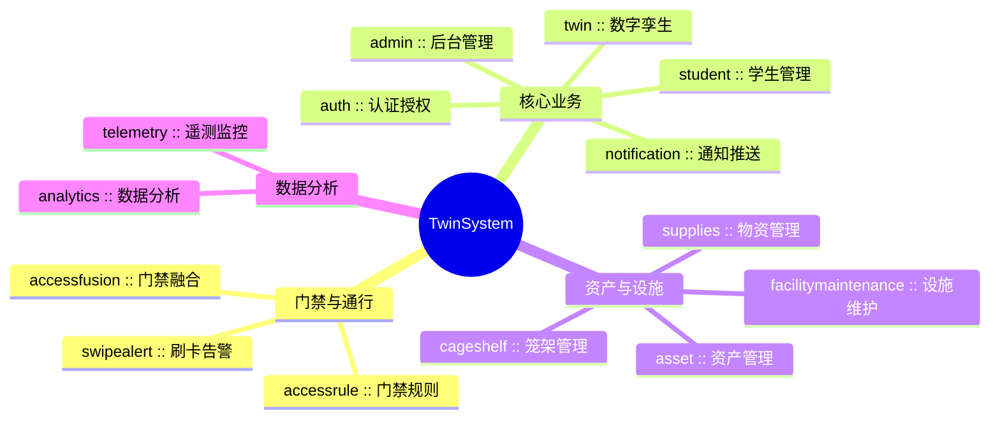

# 🏗️ TwinSystem 设计档案

欢迎来到 TwinSystem 的内部逻辑文档站。这里记录了网站的全部架构设计、业务逻辑、模块关系和发展规划。

---

## 📐 快速导航

| 你想了解什么？ | 去哪里看 |
|-------------|---------|
| 系统整体怎么设计的？ | [架构文档](后端架构规范.md) |
| 前端页面和路由怎么组织的？ | [前端 Web 架构](前端Web架构规范.md) |
| 31 个业务模块分别做什么？ | [业务逻辑导图](mindmap/mermaid/00-overview.md) |
| 如何部署和开发？ | [部署指南](部署指南.md) |
| 下一步要做什么？ | [改进路线图](改进路线图.md) |

---

## 🗺️ 业务模块一览

TwinSystem 包含 **31 个业务模块**，覆盖门禁管理、资产管理、数据分析、通知推送等场景。

[查看完整模块导图 →](mindmap/mermaid/00-overview.md)

---

## 📊 统计数据

| 指标 | 数值 |
|------|------|
| 业务模块 | 31 |
| 后端控制器 | 79 |
| 后端服务 | 154 |
| API 端点 | 580 |
| 前端页面 | 77 |

*数据由 Mindmap Scanner 自动生成（v0.1.0）*

---

## 🔧 工具

- **[思维导图工具](superpowers/specs/2026-06-09-mindmap-design-doc.md)** — 自动扫描代码生成业务导图
- **运行命令** — `npm run mindmap` 更新导图数据
