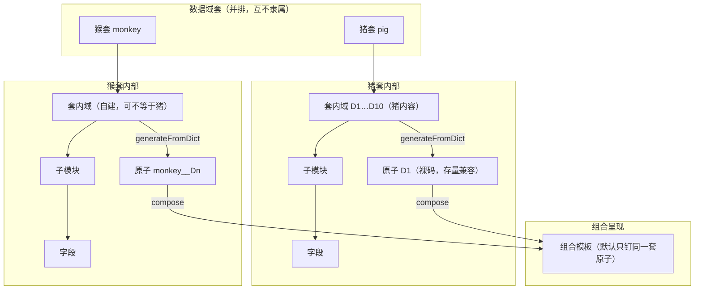

# 21-NHP 字典与模板信息架构

> 状态：**产品对齐文档（2026-08-21 修正）**。澄清「**数据域套并排** → 套内域 → 字段 → 套内原子 → 组合」；**猪套 D1–D10 是某一套的内容，不是平台元架构**。与实现对照：`NhpFieldPage` / `NhpFieldDictListPage` / `NhpTemplateListPage` / `NhpCompositeComposer` / `NhpTemplateService` / `NhpAtomFormKeys` / `NhpFieldDictionaryService`。

---

## 一、术语表（必读）

| 术语 | 是什么 | 不是什么 |
|---|---|---|
| **数据域套**（字典套） | 并排管理单元（`crf_field_dictionary.dict_key`，如 `pig` / `monkey`）。每套有自己的 `structure_json`、字段与原子。 | 不是模板；不是访视；**不是**「全局 D1–D10 骨架」。 |
| **套内数据域** | 某一套内的**表码/id**（常用 `Dn` 编码约定）。猪套可有 D1–D10；猴套可自定。展示序用 `sortOrder`，与编码数字无关。 | **不是**业务采集阶段；**不是**「第 N 步」；**不是**全平台共享目录。 |
| **子模块** | 套内域下分组 `D1.01`；对应模板 SubSection。 | 不是访视 TP；不是 hub 流程步骤。 |
| **字段** | `crf_field`（`dictionary_id` 归属套）。 | 不是题目控件。 |
| **原子模板** | `crf_form` 且 `DOMAIN\|MODULE`。猪套存量码为裸 `D1`；其它套为 `{dictKey}__{domain}`（如 `monkey__D1`）。由**该套**字段 `generateFromDict` 派生，**无需发布**。 | 不是「阶段」；不可跨套默认同名混用。 |
| **组合模板** | `crf_form` 且 `TEMPLATE`。默认钉住**同一数据域套**的原子；标题应带套名以免「NHP CRF」语义模糊。 | 不是字典；不是业务阶段条。 |
| **访视 TP** | 时点计划；与套内 D 树 **正交**。 | 不是左树。 |
| **业务阶段** | hub / 填写步进导航。 | 不要用来称呼套内域原子。 |

### 「阶段」与「全局 D1–D10」消歧（铁律）

| 说法 | 正确用法 | 错误用法 |
|---|---|---|
| 业务阶段 | hub / 填写页**可选**业务语境提示 | 模板列表里指 D1–D10；把 Dn 当填表步骤 |
| 数据域套 | 猪套 / 猴套并排 | 把猪 D1–D10 当成所有套的模板 |
| 套内数据域 / 原子 | 本套声明的**表码** → 本套原子 | 「从字典生成」下拉固定猪 D1–D10 给猴套用；D1→D10 线性进度 |
| 展示序 `sortOrder` | 字典树 / TOC / 列表排序 | 用解析 D 数字当「序号标准」或「下一序号」 |
| 访视/时点 | TP / visit | 与字典树混称「阶段」 |

产品文案：**列表侧用「数据域套 / 套内数据域（表码）/ 原子」**；**填写默认不展示域管道步进**；业务语境提示可选且与域完成度解耦。

**域编码 ≠ 序号**：`D1`…`D10` 是表码/id（可跳号、可非连续使用）；展示与导航顺序以 `structure_json` 的 `sortOrder` 为准；`compareCodedId` 仅作无 ord 时的稳定兜底。

---

## 二、层级关系（正确）



文字骨架：

```
数据域套（pig / monkey / …）     ← 先建，并排
 └─ 套内数据域（本套自定）
     └─ 子模块
         └─ 字段 …
              ↓ generateFromDict（只读本套字典）
原子模板（pig: D1；monkey: monkey__D1）
              ↓ compose（默认同套）
组合模板（标题带套名）
              ↓ 开填
实例 + 可选业务语境提示（≠ 套内域表码流水线）
```

**错误骨架（已废弃）**：把猪 D1–D10 当成平台一级架构，再让「新建数据域 / 猴套」去克隆或复用这套全局域。

**父子铁律**：字典（按套）是父；模板是子。改字典不会自动改已钉原子版本。

---

## 三、content-manager 页面 → 职责

| 路由 | 页面 | 负责 | 不负责 |
|---|---|---|---|
| `/nhp-field` | **数据域套**列表 | 建空套、进套 | 编模板、开填 |
| `/nhp-field/:dictKey` | 套内结构与字段 | 套内域/子模块、字段、提交校对、可选「从猪套克隆大纲」 | 题型、组合、实例 |
| `/nhp-field-review` | 字段校对队列 | ADMIN 代行 PI：通过→FROZEN / 驳回→DRAFT | 改字段定义、开填 |
| `/nhp-codelist` | 码表 | **整表版本**：草稿→提交校对→冻结；新建版本克隆；禁止直接改冻结取值；引用链 | 套结构 |
| `/nhp-template` | 原子 / 组合 | 按套生成原子、按套组合、发布组合 | 改字段定义 |
| `/nhp-template/edit/:formKey` | 模板编辑器 | 呈现；组合内换原子版本 | 字典权威 |
| `/nhp-hub` | 采集流程 | 业务入口；填写侧不强制 D1→D10 | 字典结构 |

侧栏顶栏「← 返回」与页内返回优先 `location.state.returnTo`（字段→码表写入含 `status`/`fieldCode` 的路径），否则 history -1 / 兜底列表。

侧栏提示：**数据域套（父，并排）→ 套内原子/组合（子）**。

---

## 四、配置点击路径（推荐）

1. **新建数据域套**（如猴）→ `/nhp-field` → 空 `structure_json`
2. **在本套内**像建文件夹一样配置结构，再挂字段（编码须落在本套已建域下）
   - **套根**随时「＋新建数据域」→ 同级 D1、D2、D3…（建完 D1 后仍可再建 D2，不限一次）
   - **域节点**「＋子模块」→ `Dn.mm`；**子模块**「＋字段」→ `Dn.mm.nnn`
   - **删除**：空域/子模块直接删；有字段须确认后 cascade 软删；含 **FROZEN** 字段则拒绝
   - 需要猪大纲时才点 **「从猪套克隆大纲」**（只克隆域/子模块，不复制字段）
   - 字段：草稿 →「提交校对」→ 管理员在 **「字段校对」** 通过并冻结（仅 FROZEN 可生成原子）
3. **生成原子**：模板页选**同一数据域套** → 选**该套已有域** → `generateFromDict` → 非猪套写入 `monkey__Dn`
4. **组合**：默认勾选同一套原子；标题写清套名
5. **发布**组合 → hub / 开填

---

## 五、后端表与键约定

| 表 / 列 | 说明 |
|---|---|
| `crf_field_dictionary` | 数据域套；`structure_json` = **本套**域/子模块大纲（含 `sortOrder` 展示序；`code` 为表码） |
| `crf_field.dictionary_id` | 字段归属套 |
| `crf_form.code`（原子） | 猪套存量：`D1`；其它套：`{dictKey}__{Dn}`（见 `NhpAtomFormKeys`） |
| `crf_form`（TEMPLATE）+ `crf_composite_atom` | 组合钉原子 formId；一键组合按 `dictKey` 过滤原子 |
| 呈现层 section/field | 模板编辑器快照 |

API 要点：

- `POST .../field-dictionaries` → 空结构 `{"domains":[]}`
- `POST .../structure/domains` → 写入**当前** `dictKey` 的同级域（可多次，D1 后再 D2）
- `POST .../structure/submodules` → 域下子模块
- `DELETE .../structure/domains/{Dn}?cascade=` → 删域；有字段须 `cascade=true`；含 FROZEN 拒绝
- `DELETE .../structure/submodules/{Dn.mm}?cascade=` → 删子模块（同上）
- `POST .../structure/clone-from/{source}` → **显式**克隆大纲
- `GET/POST .../templates?dictKey=` / `generate` body.`dictKey` → 套作用域

---

## 六、缺口与下一切片

| 优先级 | 项 | 说明 |
|---|---|---|
| ✅ | 套并排 IA + 文案 | 数据域套 / 套内域；猪 D1–D10 非全局 |
| ✅ | 空套不带猪骨架 | create 空 structure；UI 自由建域 |
| ✅ | 原子 formKey 套作用域 | `NhpAtomFormKeys`；列表/生成/组合过滤 |
| ✅ | 字段校对流可发现 | 提交校对 → 字段校对队列；`generateFromDict` 仅 FROZEN |
| ✅ | 显式从猪套克隆大纲 | clone-from API + 字段页按钮 |
| ✅ | 套内多域像文件夹 | 套根常驻「新建数据域」；域/子模块删除 + cascade |
| ✅ | 码表整表版本 UX | `code+version` 多行；版本轨 + 校对冻结 + 新建草稿；字段绑版本 id；字段页顶右「码表」带 returnTo |
| ✅ | NHP 返回保状态 | `returnTo` / URL query；壳层与页内「返回」；「返回门户」仅真回首页 |
| ✅ | 域表码 ≠ 序号 | `sortOrder` 展示序；填写去域管道步进；提交只校必填 |
| 下一刀 | 字典套冻结 / 整套 clone（含字段） | 完整版本机 |
| 下一刀 | 组合强制同套校验 | 目前 UI 默认同套；后端可再 harden |
| 下一刀 | 访视 TP 与业务阶段分栏 | 与 D 树彻底分开 |

---

## 七、与既有档案关系

- **05 / 12**：字典 vs 模板两层 — 本文再强调**套并排**一层。
- **09**：业务阶段 / TP — 不映射为套内域。
- **13**：代码分层 — 本文是信息架构。
